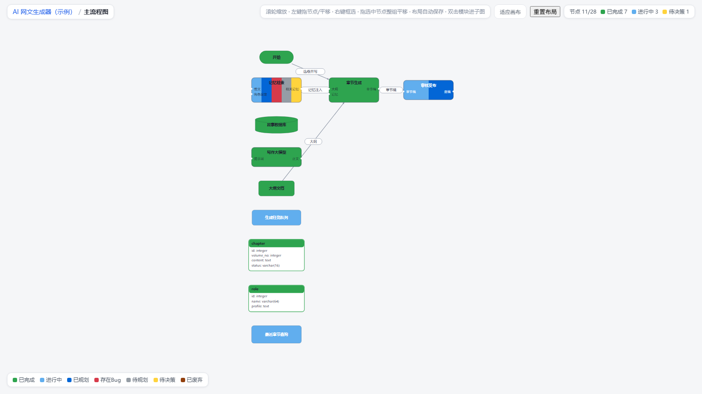

<div align="center">

# agent-flow

**让 AI agent 在开发时顺手维护一张项目流程图 —— 你再也不用读几万字的进度文档。**

[](LICENSE)
[](https://modelcontextprotocol.io)
[](https://nodejs.org)

[**🎮 在线演示**](https://wysdshg.github.io/agent-flow/demo.html) · [English](README.md)



</div>

---

## 解决什么问题

用 AI agent（Trae / Cursor / Claude Code…）做项目的人都懂：

- agent 写的**几万字 Markdown 进度文档**，根本看不下去
- 一堆专业术语看不懂，越来越不放心
- 项目做大后早偏离了最初规划，**做到哪了、哪里有坑、哪里在等你拍板**，全靠猜

**agent-flow 反过来**：agent 在开发过程中用 14 个 MCP 工具维护一张流程图（`flow.json`），你随时浏览器打开一张 HTML 看：

- 项目拆成了哪几块、谁连着谁
- 每个功能做到哪一步了 —— **7 种颜色状态**
- 哪里有 bug、哪里在等你决策

**不读文档，看图。**

## 三步上手

```bash
npm i -g agent-flow-mcp      # 全局安装（CLI + MCP 服务）
npx agent-flow init          # 在"你的项目"里执行：生成 .flow/ 并打印 MCP 配置
```

<details>
<summary>从源码安装（备选）</summary>

```bash
git clone https://github.com/wysdshg/agent-flow.git
cd agent-flow && npm install && npm run build && npm link
```

</details>

把 MCP 服务加进你的 AI 工具（Trae / Claude Desktop / Cursor 等）：

```json
{ "mcpServers": { "agent-flow": { "command": "agent-flow", "args": ["mcp"] } } }
```

> Claude Code 也可以直接：`claude mcp add agent-flow -- agent-flow mcp`

之后照常和 agent 聊天即可：**「整理一下这个项目的进度和流程」**、**「这个功能做完了，更新到流程图」**。

## 查看器（零依赖单文件 HTML）

- 滚轮缩放、拖拽平移、点节点看详情（含代码定位）
- 双击模块进子图，面包屑返回
- **模块颜色聚合**：子模块全完成 → 绿；一种未完成状态 → 该色；多种 → 分色块（已废弃节点不计入，死代码不亮红灯）
- 拖动节点自动保存在浏览器（不污染 AI 读的 JSON）；右键框选整组平移
- 网页上改状态/删节点会生成一段指令 JSON，**粘回给 agent 即同步**

## 7 态与 22 种节点

| 状态 | 颜色 | 含义 |
|---|---|---|
| completed | 🟢 绿 | 写完且测试通过 |
| in_progress | 🔵 浅蓝 | 正在写 |
| planned | 🔷 深蓝 | 方案已定，还没动手 |
| broken | 🔴 红 | 有 bug |
| to_plan | ⚪ 灰 | 待规划的想法 |
| pending_decision | 🟡 黄 | 需要你拍板 |
| deprecated | 🟤 棕 | 已废弃（保留历史） |

- 流程：`start` `end` `process` `judge` `module`
- 数据：`database` `table` `file` `sql`（表自动挂到所属库下）
- AI 应用：`llm` `tool_call` `retrieval` `rerank` `assemble` `api` `embedding` `cache` `queue` `prompt` `agent` `human_loop` `checkpoint`

布局全自动（dagre 从左到右），agent 只管拓扑，不管坐标。

## CLI 降级通道（无 MCP 环境时）

```bash
agent-flow init                 # 初始化 + 打印 MCP 配置
agent-flow batch spec.json      # 一次性建图（整理旧项目利器），自动渲染
agent-flow apply ops.json       # 依次执行 [{"tool":"add_node","args":{...}},...]
agent-flow render               # 重新布局并刷新 flow.html
agent-flow status               # 进度总览（JSON）
agent-flow validate             # 校验图合法性
agent-flow mcp                  # 启动 MCP stdio 服务
```

## 开发

```bash
npm run build   # tsc 构建
npm test        # 冒烟测试（tsx）
```

<div align="center">

**如果 agent-flow 帮你逃离了文档地狱，点个 ⭐ 让更多做项目的人看到它。**

</div>
